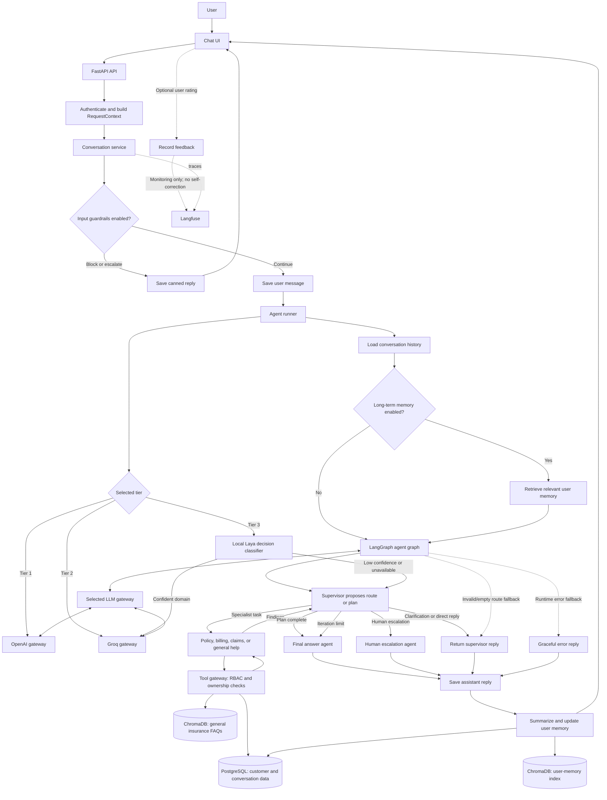

# InsureAgent Project Flow

Customer-specific facts flow through PostgreSQL tools; the FAQ vector store contains general knowledge only. The tool gateway enforces authorization independently of the LLM. Input guardrails are mode-flagged and default to off. Long-term memory retrieval is configurable; conversation history is still included, and memory summarization runs after a normal agent response. There is no consensus/voting mechanism: the supervisor routes work, and specialists return findings to it. User feedback is recorded for monitoring, not used as an automatic self-correction loop.
