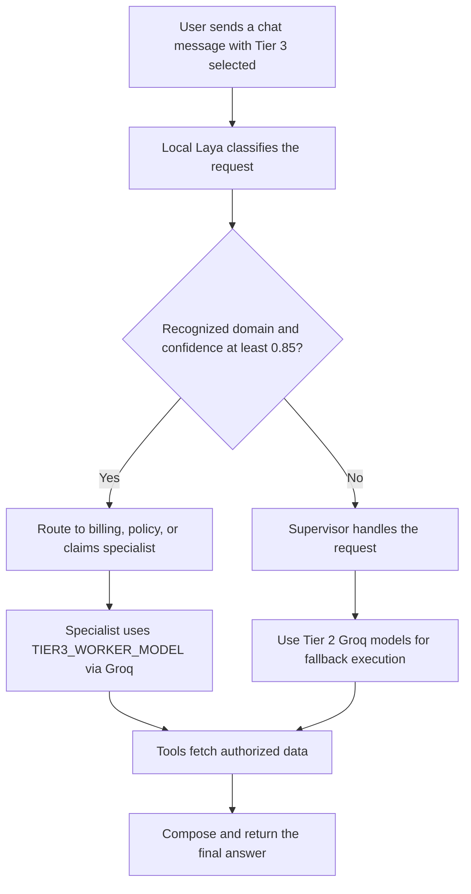

```mermaid
flowchart TD
A[User sends a chat message with Tier 3 selected] --> B[Local Laya classifies the request]
B --> C{Recognized domain and confidence at least 0.85?}
C -- Yes --> D[Route to billing, policy, or claims specialist]
C -- No --> E[Supervisor handles the request]

    D --> F[Specialist uses TIER3_WORKER_MODEL via Groq]
    E --> G[Use Tier 2 Groq models for fallback execution]

    F --> H[Tools fetch authorized data]
    G --> H
    H --> I[Compose and return the final answer]
```
