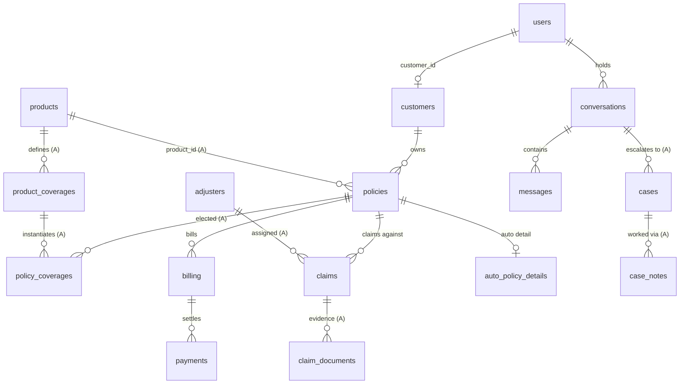

# Depth Workstream Design — Schema Tranche A · Document Corpus · Knowledge Pipeline v2

Design walkthrough for the data-and-knowledge depth plan. Review before implementation.
Roles/journey phases per the Domain model section in the [README](../../README.md) ·
versions per [docs/architecture/architecture-review.md](../architecture/architecture-review.md) (§4.1 overlay).

**Principle:** the data model is the ceiling on agent intelligence. Each step below
raises that ceiling and ships something demonstrable on its own.

---

## 1. Target ERD (all tranches; A detailed, B/C sketched)



Tranche B tables (`service_requests` with status + idempotency_key, `mandates`,
`refunds`) are designed together with the action-loop semantics — not here.
Tranche C (quotes → applications → kyc → underwriting; commissions; notifications;
audit_log) lands with v3. Both get columns sketched only when their tranche opens.

## 2. Tranche A — DDL detail

New tables (all in a new script, `utils.py` untouched):

```sql
CREATE TABLE products (
    product_id     TEXT PRIMARY KEY,          -- PRD-AUTO-01
    name           TEXT NOT NULL,             -- "SecureDrive Auto"
    product_type   TEXT NOT NULL CHECK (product_type IN ('auto','home','life','health')),
    description    TEXT NOT NULL,
    term_years_min INTEGER, term_years_max INTEGER,
    status         TEXT NOT NULL DEFAULT 'active' CHECK (status IN ('active','withdrawn')),
    version        TEXT NOT NULL DEFAULT '1.0',
    effective_date DATE NOT NULL
);

CREATE TABLE product_coverages (
    coverage_id        TEXT PRIMARY KEY,      -- COV-AUTO-COLL
    product_id         TEXT NOT NULL REFERENCES products(product_id),
    name               TEXT NOT NULL,         -- "Collision cover"
    description        TEXT NOT NULL,         -- plain-language wording (feeds corpus)
    default_limit      DECIMAL(12,2),
    default_deductible DECIMAL(10,2),
    is_optional        INTEGER NOT NULL DEFAULT 0
);

CREATE TABLE policy_coverages (
    policy_number TEXT NOT NULL REFERENCES policies(policy_number),
    coverage_id   TEXT NOT NULL REFERENCES product_coverages(coverage_id),
    limit_amount  DECIMAL(12,2),
    deductible    DECIMAL(10,2),
    added_date    DATE NOT NULL,
    PRIMARY KEY (policy_number, coverage_id)
);

CREATE TABLE adjusters (
    adjuster_id    TEXT PRIMARY KEY,
    name           TEXT NOT NULL,
    email          TEXT NOT NULL,
    specialization TEXT NOT NULL,             -- auto / property / injury / life
    active         INTEGER NOT NULL DEFAULT 1
);

CREATE TABLE claim_documents (
    doc_id      TEXT PRIMARY KEY,
    claim_id    TEXT NOT NULL REFERENCES claims(claim_id),
    doc_type    TEXT NOT NULL,                -- fir / photos / estimate / medical / invoice
    file_name   TEXT NOT NULL,
    status      TEXT NOT NULL CHECK (status IN ('requested','received','verified','rejected')),
    uploaded_at TEXT
);

CREATE TABLE cases (                          -- escalation becomes a record, not a flag
    case_id         TEXT PRIMARY KEY,
    conversation_id TEXT REFERENCES conversations(conversation_id),
    user_id         TEXT NOT NULL,            -- who was escalated
    customer_id     TEXT,
    reason          TEXT NOT NULL,
    summary         TEXT NOT NULL,            -- AI-written handoff summary
    priority        TEXT NOT NULL DEFAULT 'normal' CHECK (priority IN ('low','normal','high','urgent')),
    status          TEXT NOT NULL DEFAULT 'open' CHECK (status IN ('open','assigned','resolved')),
    assigned_to     TEXT,                     -- employee user_id
    created_at      TEXT NOT NULL,
    resolved_at     TEXT
);

CREATE TABLE case_notes (
    note_id        TEXT PRIMARY KEY,
    case_id        TEXT NOT NULL REFERENCES cases(case_id),
    author_user_id TEXT NOT NULL,
    note           TEXT NOT NULL,
    created_at     TEXT NOT NULL
);
```

Column additions to existing tables (idempotent `ALTER TABLE ... ADD COLUMN`):

```sql
-- policies
product_id TEXT REFERENCES products(product_id);
end_date DATE; renewal_date DATE;
sum_assured DECIMAL(12,2); grace_period_days INTEGER DEFAULT 30;

-- claims
stage TEXT CHECK (stage IN ('intimated','documents_pending','under_assessment',
                            'approved','rejected','settled'));
adjuster_id TEXT REFERENCES adjusters(adjuster_id);
approved_amount DECIMAL(12,2); paid_amount DECIMAL(12,2);
settled_date DATE; rejection_reason TEXT;

-- conversations (deferred FK from DDL review)
--   user_id gains REFERENCES users(user_id) at the next store-schema rebuild
```

## 3. Seed enrichment — journey-phase fidelity rules

`scripts/tranche_a.py` (idempotent, like `seed_users.py`) **enriches** the existing
synthetic rows rather than regenerating them — no conflict with
`utils.generate_sample_data()`:

1. ~8 products authored by hand (2 per product_type) with real coverage wording —
   these seed both the DB and the document corpus.
2. Each policy gets `product_id` (matched by policy_type), coverage elections,
   and computed lifecycle dates: `end_date = start_date + term`,
   `renewal_date` accordingly.
3. **Status re-derived from dates** so data never lies: policy marked `active`
   whose end_date has passed becomes `matured`; a distribution of policies is
   deliberately placed in renewal-due / grace / lapsed windows relative to TODAY
   so every servicing phase is demo-able on any date.
4. Claims: `stage` assigned consistently with existing `status` and ordered dates
   (intimated ≤ documents ≤ assessment ≤ settled); adjusters assigned by
   specialization; settled claims get paid_amount ≤ approved_amount ≤ estimated_loss.
5. Demo users extended: `customer3@demo.local` (renewal due), `customer4@demo.local`
   (lapsed, revivable) so the new phases are one login away.

**Consistency is the deliverable** — inconsistent synthetic data teaches agents
wrong patterns. A `scripts/verify_consistency.py` check (dates ordered, statuses
match dates, amounts ordered) runs at the end of seeding and later in CI.

## 4. Document corpus — generated from the catalog

`scripts/generate_documents.py` renders `datasources/documents/` from the DB so
retrievable text can never contradict the system of record:

```
datasources/documents/
├── products/PRD-AUTO-01/
│   ├── brochure.md          # from products + product_coverages
│   ├── policy_wording.md    # per-coverage terms, exclusions, deductibles
│   ├── faq.md               # generated Q&A about THIS product
│   └── claims_guide.md      # doc requirements by incident type
├── company/                  # how-to guides: payments, renewal, grace, surrender
└── industry/                 # insuranceQA-v2 subset (existing) + optional
                              # regulator consumer guides (fetched respectfully,
                              # attributed) — tagged industry-general
```

Deterministic templates first (consistency guaranteed); optional LLM polish later
behind a flag. Every file carries YAML frontmatter — the retrieval metadata:

```yaml
source: company | industry-general
product_id: PRD-AUTO-01 | null
doc_type: brochure | wording | faq | claims_guide | consumer_guide
version: "1.0"
effective_date: 2026-01-01
access_level: public | customer | agent | internal
```

## 5. Knowledge pipeline v2

New package `app/knowledge/` (mirrors the auth/conversations pattern):

```python
class RetrievedChunk(BaseModel):
    text: str; source_file: str; doc_type: str
    product_id: str | None; access_level: str; score: float

class KnowledgeRetriever(ABC):
    @abstractmethod
    def search(self, query: str, ctx: RequestContext,
               product_id: str | None = None, top_k: int = 5) -> list[RetrievedChunk]: ...
```

`HybridChromaRetriever` implementation — all local, no new infra:
1. **Access filter first:** allowed access_levels derived from `ctx.user.role`
   (customer → public+customer; agent → +agent; employee/admin → +internal).
   Enforced as a Chroma metadata filter — the project's authorization rule
   ("enforced in the system, never by the LLM") extended into retrieval;
   over-permissioned chunks are never even scored.
2. **Hybrid:** Chroma semantic + BM25 keyword (`rank_bm25`, in-memory) merged.
3. **Rerank:** cross-encoder (`sentence-transformers`, already installed) over
   the merged top-20 → top_k.
4. Chunks carry metadata → **citations**: the answer path appends
   "Source: SecureDrive Auto — Policy Wording v1.0".

Ingestion: `scripts/ingest_documents.py` → new collection `knowledge_v2`
(heading-aware chunking, frontmatter → chunk metadata). Old collection stays
until cutover.

**Integration seam (interim, pre-refactor):** `utils.general_help_agent_node`
takes a `collection` and calls `.query()`. We hand it a thin adapter object
exposing `query()` backed by `KnowledgeRetriever` with the request's ctx bound —
zero `utils.py` changes now; becomes a first-class dependency in Jayanth's
refactor. (Same pattern as the `ask_user` seam.)

## 6. Retrieval golden set + evals

`tests/eval/retrieval_golden.jsonl` — 30–50 rows:
`{"question": ..., "expect_source": "PRD-AUTO-01/policy_wording", "role": "customer"}`
including **negative cases** (customer must NOT retrieve internal docs).
`tests/eval/test_retrieval.py` computes hit@3 (threshold ≥ 0.8) and asserts the
access-control negatives absolutely. Wire into minimal CI alongside
`verify_consistency.py`. No LLM calls — cheap enough for every PR.

## 7. Build order & exit criteria

| Step | Deliverable | Exit criterion |
| --- | --- | --- |
| 1 | `scripts/tranche_a.py` + `verify_consistency.py` | Existing agents answer renewal dates / claim stages / adjuster names with zero agent-code changes; consistency check green |
| 2 | `scripts/generate_documents.py` + corpus | Corpus renders from DB; spot-check: no statement contradicts the DB |
| 3 | `app/knowledge/` + ingestion + adapter cutover | "Does my auto policy cover rental cars?" → DB answer + quoted wording with citation; internal docs never surface to customers |
| 4 | Golden set + eval tests (+ CI) | hit@3 ≥ 0.8; access negatives 100% |

## 8. Team touchpoints

- **Jayanth:** two adapter seams (`collection` adapter here, `ask_user` earlier)
  are refactor inputs; schema extensions continue to live outside `utils.py`.
- **Krishna:** access-level filtering in retrieval borders guardrails — align on
  who owns "customer never sees internal content" (proposal: retrieval enforces,
  guardrails verify — defense in depth).
- **ADR to record when adopted:** "Knowledge corpus is generated from the product
  catalog; external insurer content is out of scope" (consistency > realism).
