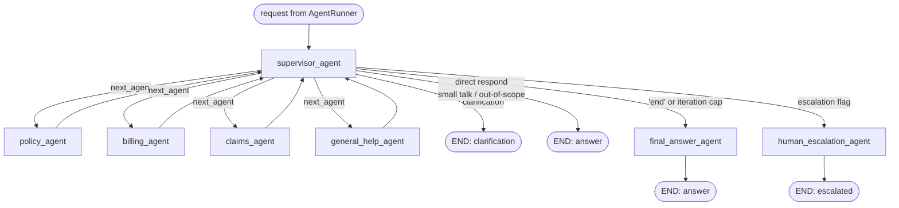

# Orchestrator — Agent Layer Structure

The rebuilt agent layer (`app/agents/`, `app/tools/`, `app/llm/`), replacing
the POC graph that lived in `utils.py`. Same hub-and-spoke shape, now with two
gateways: the **tool gateway** governs what agents may *do* (authorization,
audit); the **LLM gateway** governs how agents *think* (tiers, cost,
reliability).

## The graph (app/agents/orchestrator.py)

Three **first-class outcomes**: `answer | clarification | escalation` — a
clarification question is simply the graph's result (the old console-input
monkeypatch is gone); the user's reply returns via conversation history.

Non-task messages (greetings, capability questions, out-of-scope requests) get
a **direct supervisor response** (`next_agent: "respond"`) — no specialist, no
tools, one LLM call. A contract-violating supervisor reply (no JSON) is treated
as that direct response, never guessed into a route. The iteration cap (3) exits
via **final_answer with an offer of human help** — escalation is reserved for
flagged reasons, never loop exhaustion.

## Identity flow — the core rule

`RequestContext` (user, role, owned policies, correlation_id) travels in
LangGraph's **config channel**, never in LLM-visible state. The tool gateway
injects it as every tool's first argument; tools enforce ownership in SQL
(`AND customer_id = ctx...` / agent book scoping). A customer cannot read
another customer's rows even if the LLM asks — verified by
`tests/test_tool_gateway.py`. **LLMs reason; systems decide.**

## Files and responsibilities

| File | Owns |
| --- | --- |
| `agents/state.py` | `GraphState`: input, routing fields, `complexity`, `collected_facts`, outcomes |
| `agents/supervisor.py` | Intent → routing JSON (next_agent/task/complexity), direct `respond` for non-task messages, or `ask_user` clarification; parse-failure fallback; iteration guard (3, exits gracefully) |
| `agents/base.py` | `SpecialistAgent`: YAML prompt → LlmGateway call → tool loop via ToolGateway → facts into state |
| `agents/specialists.py` | Policy / Billing / Claims / GeneralHelp — name + prompt + tool list each. Boundary: policy = contract, billing = money movement. FAQ retrieval is deterministic (pre-fetched, not an LLM tool choice) |
| `agents/terminal.py` | `final_answer_node` (composes from collected_facts, discovers nothing) · `escalation_node` (writes a `cases` row post-Tranche A) |
| `agents/orchestrator.py` | Graph assembly + `route_after_supervisor` (priority-ordered plain code) |
| `agents/runner.py` | Per-request state + config(ctx, gateways) → invoke → `AgentResult`. No `utils.py` import |
| `tools/gateway.py` | Registry (ToolSpecs with `required` schemas), arg validation, RBAC role→tool, timeout, audit line per call (correlation_id) |
| `tools/*_tools.py` | Implementations: `(ctx, **args)`, ownership scoping in SQL via shared `_scope(ctx)` |
| `llm/gateway.py` | Single LLM chokepoint: tier routing → config-resolved model → retries → tier-fallback → CallRecord (tokens/cost/latency) |
| `llm/router.py` | Flag OFF (default): static tiers (supervisor=STANDARD, others=FAST). Flag ON (`COMPLEXITY_ROUTING_ENABLED`): supervisor's complexity score upgrades specialists. Both paths always unit-tested |
| `llm/provider.py` | `LlmProvider` ABC + OpenAI impl — the only LLM SDK import in the codebase (Bedrock = one new class, decision D1) |

## RBAC matrix (tools/gateway.py registry)

| Tool | prospect | customer | agent | employee/admin |
| --- | --- | --- | --- | --- |
| search_faq | ✅ | ✅ | ✅ | ✅ |
| get_policy_details / auto details | — | own | book | all |
| list_my_policies | — | own | book | — |
| get_billing_info / payment_history | — | own | book | all |
| get_claim_status | — | own | book | all |

## Known limits (current)

1. Synchronous invocation — no streaming yet.
2. Iteration cap of 3 — inherited; tune with evals.
3. Langfuse tracing not yet re-wired into the new layer (CallRecords + audit
   lines log locally; hook Langfuse at the two gateways — one place each).
4. `utils.py` is now unreferenced — retirement/deletion is a separate commit
   pending Jayanth's review.
